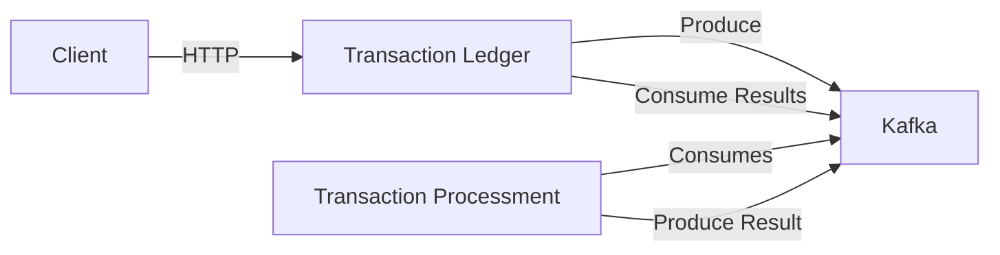

# Transaction Hub

This is a transaction processing system project developed in Go, using a microservices architecture. The system is composed of two main services that communicate through Apache Kafka:

- **Transaction Ledger**: Responsible for receiving transaction requests via REST API
- **Transaction Processment**: Responsible for processing transactions and returning the results

## Technologies Used

- Go 1.24
- PostgreSQL
- Apache Kafka
- Docker & Docker Compose
- REST API

## Architecture



## Project Structure

```
.
├── pkg/ # Common configurations
├── transaction-ledger/     # Transaction receiving service
│   ├── cmd/
│   ├── domain/
│   ├── handlers/
│   ├── application/
│   ├── infra/
│   └── Dockerfile
├── transaction-processment/ # Transaction processing service
│   ├── cmd/
│   ├── application/
│   └── Dockerfile
├── docker-compose.yml
└── docker-compose.infra.yml
```

## How to Run

There are two ways to run the project:

### 1. Using Docker Compose (Complete Mode)

This method will start all services in Docker containers:

```bash
docker-compose up -d
```

Services will be available at:

- Transaction Ledger: http://localhost:8080
- Transaction Processment: No http server, only kafka consumer
- Kafka UI: http://localhost:9021

### 2. Running Services Separately

#### 2.1 Starting the Infrastructure

First, start the infrastructure services (PostgreSQL and Kafka):

```bash
docker-compose -f docker-compose.infra.yml up -d
```

#### 2.2 Running Services Locally

In separate terminals, run:

For Transaction Ledger:

```bash
make run-ledger
```

For Transaction Processment:

```bash
make run-processment
```

## Data Flow

1. The client sends a transaction request to Transaction Ledger via REST API
2. Transaction Ledger validates the request and publishes a message to the Kafka pending transactions topic
3. Transaction Processment consumes the message, processes the transaction and publishes the result to a Kafka results topic
4. Transaction Ledger consumes the result message and updates the transaction status
5. The client can check the transaction status via REST API

## Main Endpoints

### Transaction Ledger

- POST /transactions - Creates a new transaction
- GET /transactions - Lists all transactions
- GET /transaction/:ID - Gets a specific transaction

Request examples can be found on ./request.http (Rest Client extention required to run on editor)

## Kafka Topics

- `process-transactions` - Pending transactions for processing
- `transaction-process-return` - Transaction processing results

## Load Testing

The project includes load testing capabilities using Autocannon. To run the load tests, first install Autocannon:

### Installing Autocannon

```bash
# Using npm
npm install -g autocannon

# Using yarn
yarn global add autocannon
```

To run the load tests:

For Windows:

```bash
# with makefile
make loader-windows

# executing directly
./loader.ps1
```

For Linux:

```bash
# with makefile
make loader-linux

# executing directly
./loader.sh
```

### Load Test Results

The system was tested under different scenarios:

1. **10-second test**:

   - Average latency: 197.31 ms
   - Requests per second: ~999
   - Total requests: 10k in 10.04s

2. **60-second test**:

   - Average latency: 417.88 ms
   - Requests per second: ~477
   - Total requests: 29k in 60.18s

3. **5-minute test**:
   - Average latency: 441.75 ms
   - Requests per second: ~453
   - Total requests: 272k in 600.34s

The full file is on ./loader-results.txt

The tests were performed with:

- 20 concurrent connections
- 10 pipelining factor
- Target endpoint: http://localhost:8080/transaction
