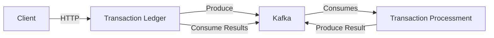

# Transaction Hub

This is a transaction processing system project developed in Go, using a microservices architecture. The system is composed of two main services that communicate through Apache Kafka:

- **Transaction Ledger**: Responsible for receiving transaction requests via REST API
- **Transaction Processment**: Responsible for processing transactions and returning the results

## Technologies Used

- Go 1.24
- PostgreSQL
- Apache Kafka
- Docker & Docker Compose
- REST API

## Architecture



## Project Structure

```
.
├── transaction-ledger/     # Transaction receiving service
│   ├── cmd/
│   ├── domain/
│   ├── handlers/
│   ├── application/
│   ├── infra/
│   └── Dockerfile
├── transaction-processment/ # Serviço de processamento de transações
│   ├── cmd/
│   ├── application/
│   └── Dockerfile
├── docker-compose.yml
└── docker-compose.infra.yml
```

## Como Executar

Existem duas maneiras de executar o projeto:

### 1. Utilizando Docker Compose (Modo Completo)

Este método iniciará todos os serviços em containers Docker:

```bash
docker-compose up -d
```

Os serviços estarão disponíveis em:

- Transaction Ledger: http://localhost:8081
- Transaction Processment: http://localhost:8082
- Kafka UI: http://localhost:9021

### 2. Executando Serviços Separadamente

#### 2.1 Iniciando a Infraestrutura

Primeiro, inicie os serviços de infraestrutura (PostgreSQL e Kafka):

```bash
docker-compose -f docker-compose.infra.yml up -d
```

#### 2.2 Executando os Serviços Localmente

Em terminais separados, execute:

Para o Transaction Ledger:

```bash
make run-ledger
```

Para o Transaction Processment:

```bash
make run-processment
```

## Fluxo de Dados

1. O cliente envia uma solicitação de transação para o Transaction Ledger via API REST
2. O Transaction Ledger valida a requisição e publica uma mensagem no tópico Kafka de transações pendentes
3. O Transaction Processment consome a mensagem, processa a transação e publica o resultado em um tópico Kafka de resultados
4. O Transaction Ledger consome a mensagem de resultado e atualiza o status da transação
5. O cliente pode consultar o status da transação via API REST

## Endpoints Principais

### Transaction Ledger

- POST /transactions - Cria uma nova transação
- GET /transactions - Lista todas as transações

## Tópicos Kafka

- `process-transactions` - Transações pendentes de processamento
- `transaction-process-return` - Resultados do processamento das transações
